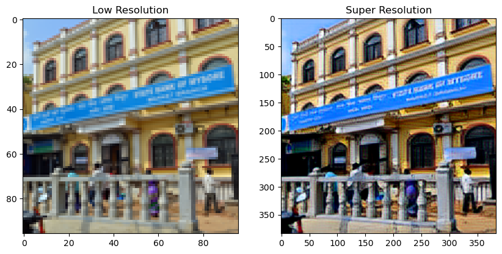

# ESRGAN

A Tenserflow implementation of SRGAN based on CVPR 2017 paper "ESRGAN: Enhanced Super-Resolution Generative Adversarial Networks". In addition, by applying the data augmentation concept of the "Real-ESRGAN: Training Real-World Blind Super-Resolution with Pure Synthetic Data" paper to this model, it has been modified to enhance jpeg compression loss and achieve better performance in restoring faded and degraded images compared to general ESRGAN.

The train-datasets and valid-datasets are sampled from DIV2K. DIV2K-dataset has 800 images, and the models tested with Set 5 dataset.

In the original paper, the model was trained through 300,000 iterations. However, due to time constraints and equipment limitations, it was not possible to perform as many iterations as in the paper. The result below is the result obtained after about 30,000 iterations. For better results, please train additionally.

Enviroment

    python          3.9.13
    tensorflow      2.10.0
    numpy           1.21.5
    opencv-python   4.6.0.66
    
# Usage

## Train 

1. Put train image dataset at ./train folder. You can find useful dataset on [Visual Object Classes Challenge 2012 (VOC2012)](http://host.robots.ox.ac.uk/pascal/VOC/voc2012/index.html#data)

To train PSNR based model, type the code below on your cmd.

    python train_pnsr.py

To train GAN based model, type the code below on your cmd.

    python train.py

Or you can choose directory to train by using arguments(--train_dir).

optional arguments:

    --epochs                 epochs
    --batchs                 batchs
    --lr_g                   learning rate of generator
    --lr_d                   learning rate of discriminator
    --train_dir              directory of image to train / 학습 할 이미지 위치
    --load_model             load saved model / 저장된 모델 불러오기 (1: True, 0: False)
    --use_cpu                forced to use CPU only / CPU 만 이용해 학습하기 (1: True, 0: False)

## Test Single Image

Put test image in ./test folder.

To test dataset, type the code below on your cmd.

    python test.py

The result will be saved in ./result folder.

optional arguments:

    --target_folder         directory of image to process super resolution / super resolution 처리할 이미지 위치
    --save_folder           directory to save super resoultion image / super resolution 처리된 이미지 저장 위치
    --alpha                 ratio of GAN-based-model to PSNR-based-model / GAN 기반 모델과 PNSR 기반 모델의 비율
